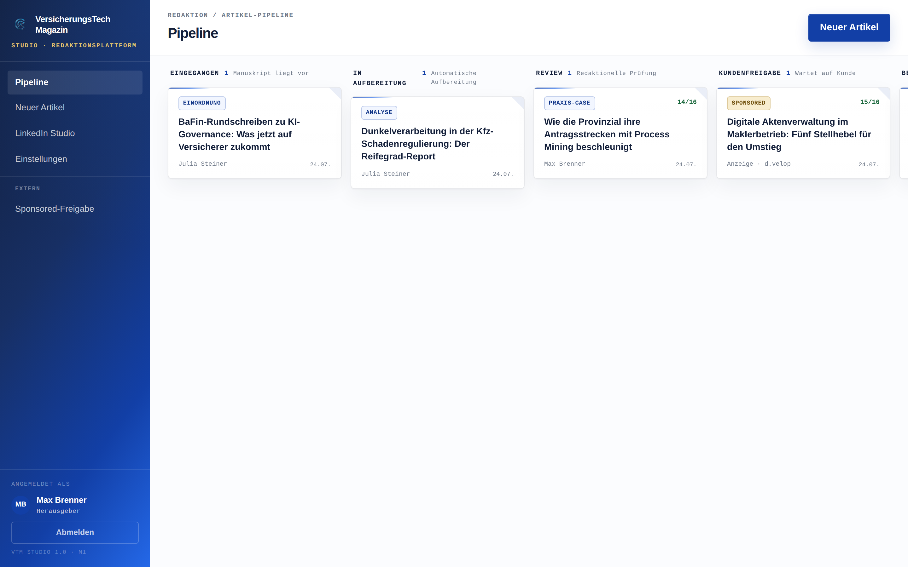
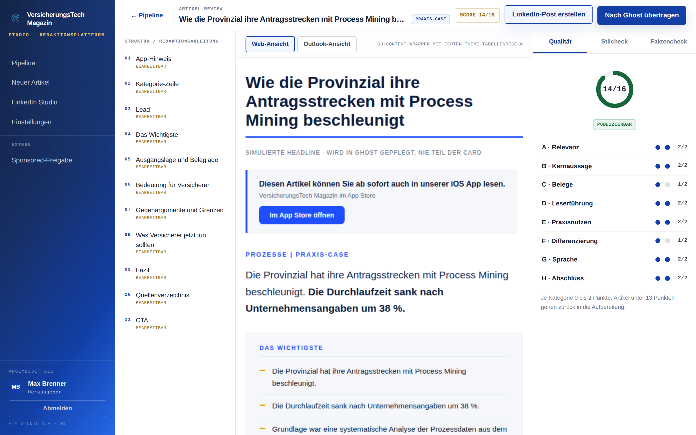
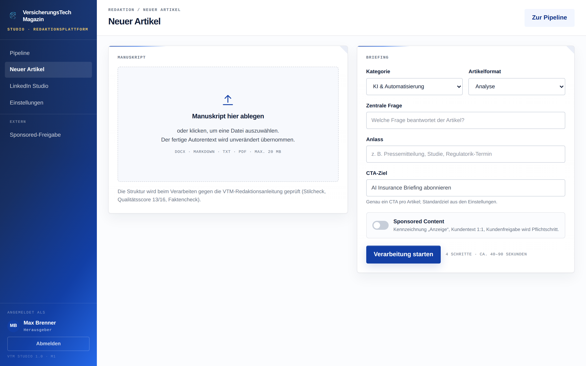
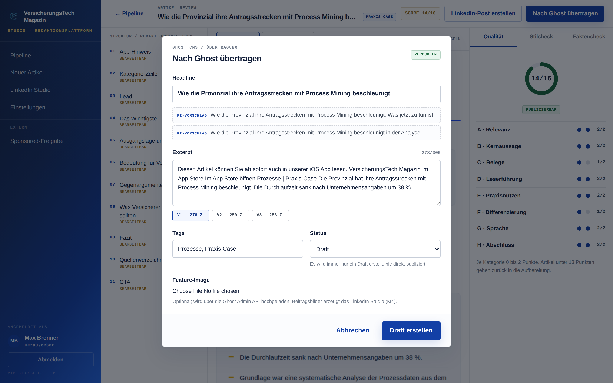
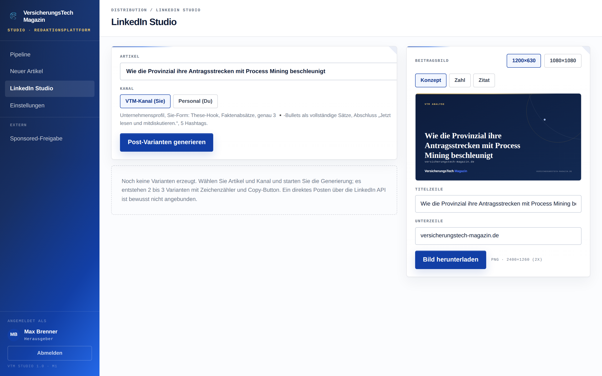
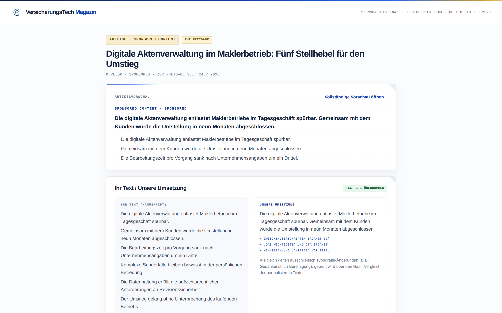
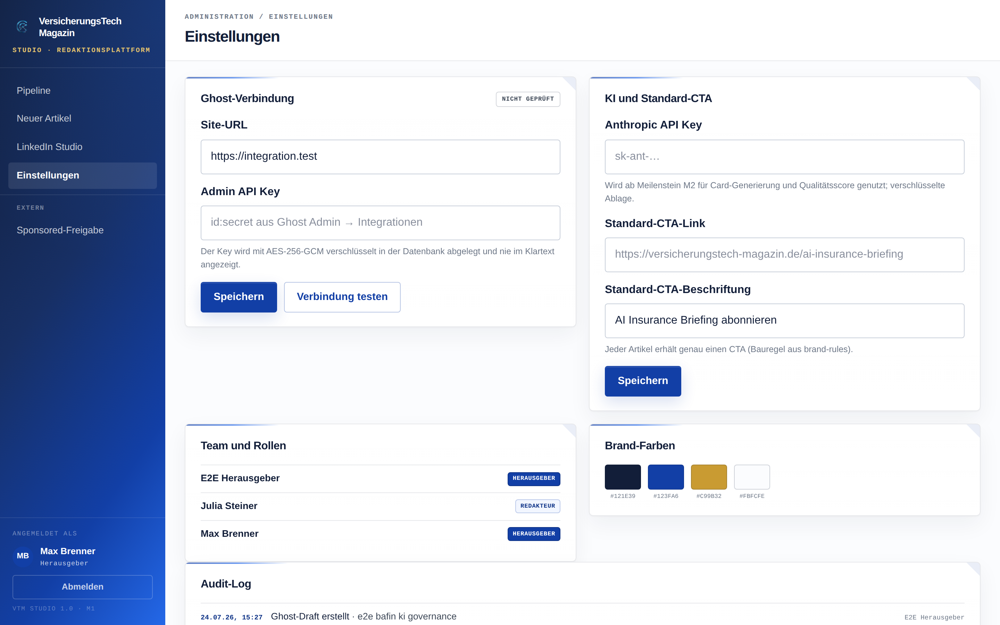

# VTM Studio

Interne Redaktionsplattform des **VersicherungsTech Magazins (VTM)**. VTM Studio verwandelt hochgeladene Autorentexte automatisiert in publikationsreife Ghost-CMS-Artikel-Drafts im VTM-Design und erzeugt LinkedIn-Posts samt Beitragsbild im Corporate Design.

Auftrag und Meilensteinplan: `PROMPT_Claude_Code_VTM_Studio.md` · Umsetzungsplan M1: `docs/PLAN_M1.md`

**Stand: Meilenstein M5 – alle Meilensteine umgesetzt.** M1 Fundament (Auth, App-Shell, Pipeline-Board, Einstellungen mit Ghost-Verbindungstest und verschlüsselter Key-Ablage) · M2 Artikel-Pipeline (Upload, Verarbeitungsjob mit Stepper, Stilcheck-Port, LLM-Score 13/16, Faktencheck, Review-Screen mit Web-/Outlook-Preview und Inline-Bearbeitung) · M3 Ghost-Publishing (Publish-Modal, Draft als Lexical-Dokument mit genau einer html-Card-Node, Feature-Image-Upload, Status IN_GHOST) · M4 LinkedIn Studio (Post-Generator VTM/Personal, SVG-Beitragsbilder mit PNG-Export 2x) · M5 Sponsored-Freigabe (tokenisierte Kundenansicht `/freigabe/[token]` ohne Account, Diff Kundentext ↔ Card-Fließtext mit Typografie-Normalisierung und Badge „Text 1:1 übernommen“, Kommentar, Freigeben/Änderung anfragen, E-Mail-Benachrichtigung an den Herausgeber, AuditLog-Ansicht, Empty/Loading/Error-States, Responsive-Pass).

## Screenshots

| | |
|---|---|
|  |  |
| Pipeline-Kanban | Artikel-Review (Outline · Preview · Prüf-Panel) |
|  |  |
| Upload mit Briefing | Ghost-Publish-Modal |
|  |  |
| LinkedIn Studio mit Bild-Generator | Kundenansicht Sponsored-Freigabe |
|  | |
| Einstellungen mit Audit-Log | |

Die Screenshots entstehen reproduzierbar über `npx tsx scripts/screenshots.ts` gegen die lokal gestartete App (Seed-Daten, `MOCK_KI=1`).

### KI-Betrieb (M2)

- Card-Generierung, Qualitätsscore und Faktencheck laufen über die Anthropic API (Modell `claude-sonnet-4-6`, im Auftrag fixiert). Der Systemprompt wird zur Laufzeit aus `brand-rules/` zusammengesetzt; bei Sponsored Content mit Vorrangregeln aus `sponsored-content.md`.
- Der API-Key kommt aus den Einstellungen (verschlüsselt) oder aus `ANTHROPIC_API_KEY`.
- **`MOCK_KI=1`** aktiviert eine deterministische Mock-Schicht ohne API-Key (Entwicklung, CI, E2E): Die Card wird aus den Original-Bausteinen in `references/komponenten.md` gebaut und besteht den Stilcheck.
- Die Verarbeitung läuft als DB-Queue mit Status-Polling: Jeder Poll-Tick führt genau einen Schritt aus (serverless-tauglich, kein Redis, kein Worker).

## Architekturüberblick

- **Next.js 15 (App Router) + TypeScript strict**, Tailwind CSS; Design-Tokens und Komponentenklassen 1:1 aus dem Design-System in `design/_ds` portiert (`app/globals.css`)
- **Prisma + PostgreSQL** (Neon-kompatibel); vollständiges Kern-Datenmodell bereits in M1 (`prisma/schema.prisma`): User/Rollen, Artikel mit Pipeline-Status, LinkedInPost, FreigabeToken, Einstellung, AuditLog, Job-Queue
- **Auth.js (NextAuth v5)** mit E-Mail-Magic-Link und Rollen `HERAUSGEBER` / `REDAKTEUR`; ohne SMTP-Konfiguration wird der Anmeldelink in der Server-Konsole ausgegeben
- **Ghost Admin API**: `lib/ghost.ts` erzeugt kurzlebige HS256-JWTs aus dem Admin API Key und testet die Verbindung über `GET /ghost/api/admin/site/` (Basis für das Publishing in M3)
- **Verschlüsselte Key-Ablage**: `lib/crypto.ts` (AES-256-GCM, Schlüssel aus `ENCRYPTION_SECRET`); API-Keys liegen nie im Klartext in der Datenbank und werden im UI nur maskiert angezeigt
- **Brand-Rules**: `brand-rules/` ist die Single Source of Truth für die Artikel-Generierung (ab M2)

```
app/            Routen: /login, /pipeline, /artikel, /einstellungen, /linkedin, /freigabe
components/     shell/ (Sidebar, Topbar), pipeline/, ui/
lib/            auth, crypto, ghost, einstellungen, audit, status, db
prisma/         schema.prisma, migrations/, seed.ts
tests/          unit/ (Vitest, DB-frei), integration/ (nur GitHub Actions)
.github/        workflows/ci.yml (Jobs: check + integration)
```

## Setup

### Weg A: Sandbox / CI (ohne Docker)

Build, Lint, Typecheck und Unit-Tests laufen vollständig ohne Container und ohne Datenbank:

```bash
npm ci
npx prisma generate
npm run lint
npm run build
npm run typecheck
npm test
```

Integrationstests (Postgres/Ghost) laufen **ausschließlich in GitHub Actions** gegen Service-Container (`postgres:16`, `ghost:5-alpine`) und werden lokal automatisch übersprungen (Env-Flag `RUN_INTEGRATION=1` fehlt).

### Weg B: Lokale Entwicklung mit Docker

```bash
cp .env.example .env        # Werte eintragen (mindestens DATABASE_URL, AUTH_SECRET, ENCRYPTION_SECRET)
docker compose up -d        # startet postgres:16 und ghost:5-alpine
npx prisma migrate deploy   # Schema anwenden
npx prisma db seed          # Beispieldaten für das Pipeline-Board
npm run dev                 # http://localhost:3000
```

Anmeldung: E-Mail-Adresse eingeben; ohne `SMTP_*`-Konfiguration erscheint der Magic-Link in der Konsole des Dev-Servers. Der erste Benutzer wird als `REDAKTEUR` angelegt; die Rolle `HERAUSGEBER` wird per SQL/Prisma Studio gesetzt (`npx prisma studio`).

## Deployment (Vercel + Neon)

1. Neon-Projekt anlegen, `DATABASE_URL` (Pooled Connection) kopieren
2. Repository bei Vercel importieren; Framework-Preset Next.js
3. Umgebungsvariablen setzen (siehe `.env.example`): `DATABASE_URL`, `AUTH_SECRET`, `ENCRYPTION_SECRET`, `APP_URL`, `SMTP_*`; `GHOST_URL`/`GHOST_ADMIN_API_KEY` und `ANTHROPIC_API_KEY` können alternativ verschlüsselt über die Einstellungsseite gepflegt werden
4. Migrationen beim Deploy anwenden: Build-Command auf `npx prisma migrate deploy && npm run build` setzen (oder Migrationsschritt in der CI ausführen)

Secrets liegen ausschließlich in `.env` bzw. als Vercel/GitHub-Actions-Secrets – niemals im Repository.

## Qualität

- CI (`.github/workflows/ci.yml`): Job `check` (install, lint, typecheck, build, Unit-Tests) bei jedem Push/PR; Job `integration` mit Service-Containern `postgres:16` und `ghost:5-alpine`. Grüne CI ist Merge-Bedingung.
- Unit-Tests (Vitest, DB-frei): Verschlüsselung, Ghost-JWT/Verbindungstest, Board-Gruppierung, Stilcheck-Fixtures (deckungsgleich zum Python-Original), Abschnitts-Parser, Preview-Transformationen, Lexical-Payload-Builder, Excerpt-Längen
- Integrationstests (nur GitHub Actions): Prisma-Roundtrip gegen `postgres:16`; Ghost-Draft gegen `ghost:5-alpine` – die Instanz provisioniert sich selbst (Setup-Endpoint, Session-Login, Integration + Admin API Key programmatisch) und verifiziert, dass die Card **unverändert** als einzige html-Card-Node im Lexical-Dokument liegt
- E2E (Playwright, CI-Job `e2e`): Happy-Path Upload → Verarbeitung → Review → Publish-Modal → Draft gegen die lokal gestartete App mit `MOCK_KI=1` und `MOCK_GHOST=1`

## Screenshots

Screenshots der App-Shell, des Pipeline-Boards und der Einstellungsseite folgen mit dem Review des M1-PRs (die Screens entsprechen dem Prototyp in `design/VTM Studio.dc.html`).
